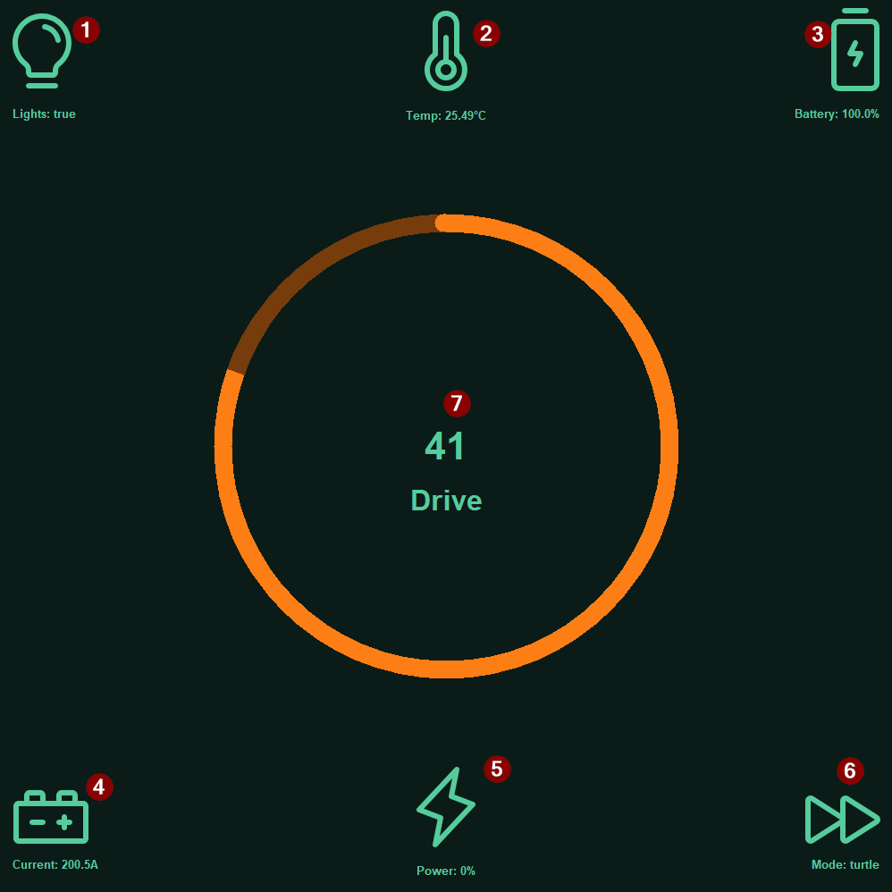

## Guide d'utilisateur
### Descritption
Ceci est le guide d'utilisateur. Il contient les branchements du module tableau de bord et un explication complète de son affichage
Pour retourner au README clické [ici](<../README.md>)
### Branchement

### Affichage

    1. Affiche l'état des lumières
    2. Affiche la température
    3. Affiche l'état de la batterie
    4. Affiche le courant des moteurs (A)
    5. Affiche la puissace utilisé
    6. Affiche le mode d'utilisation (turtle ou rabbit)
    7. Affiche la vitesse (km/h)
