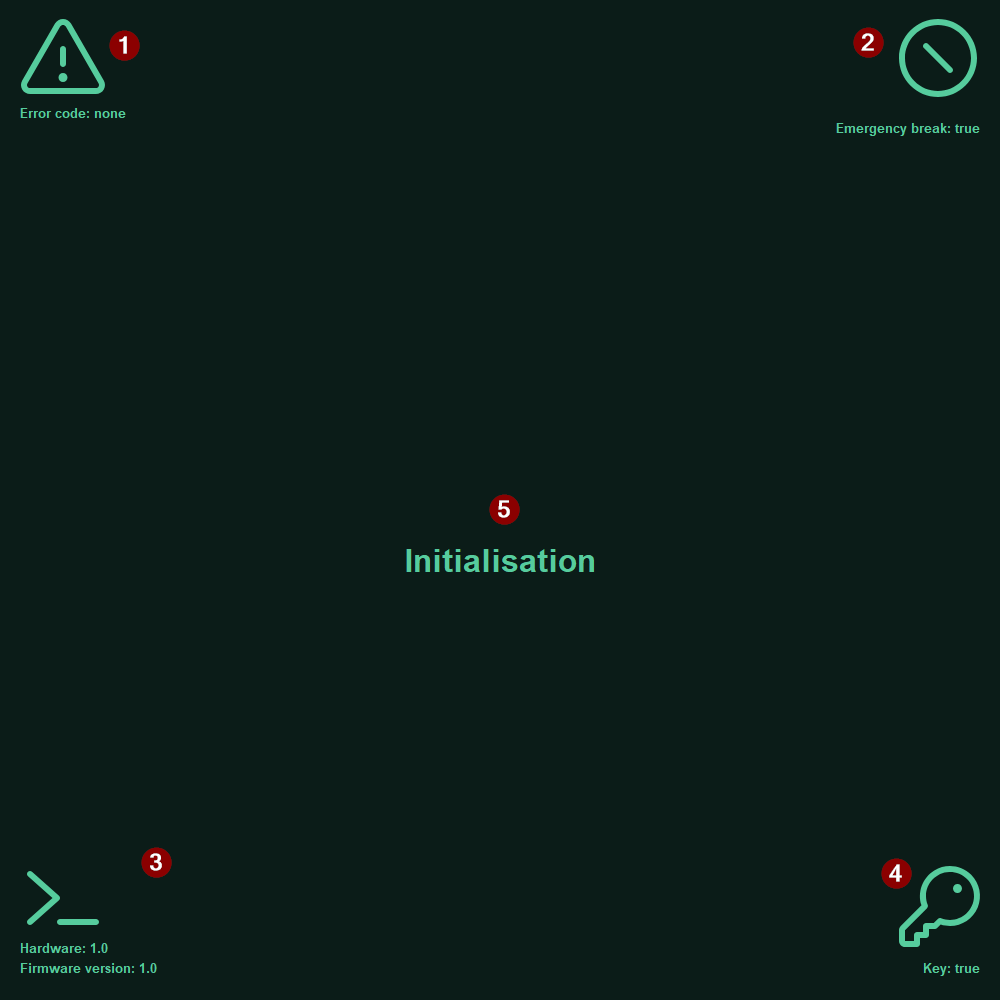

## Guide d'utilisateur
### Descritption
Ceci est le guide d'utilisateur. Il contient les branchements du module tableau de bord et un explication complète de son affichage
Pour retourner au README clicker [ici](<../README.md>)
### Branchement

- **1.** Alimenter le PCB avec l'alimentation 12V
- **2.** Brancher le cable HDMI dans le port HDMI du Raspberry Pi
- **3.** Alimenter le Raspberry Pi avec un cable USB-C
- **5.** Brancher le BMI avec un câble I2C | Exemple: [4399](https://www.digikey.ca/en/products/detail/adafruit-industries-llc/4399/10824268?gclsrc=aw.ds&gad_source=1&gad_campaignid=17336435733&gclid=Cj0KCQjwqPLOBhCiARIsAKRMPZrVaYoQh6BjAgbfN6MktjoXuiRVQwjho6AzrgFkBbMqADUwDK0_j78aAlHEEALw_wcB)

### Affichage
**En mode DRIVE:** 

- **1.** Affiche l'état des lumières
- **2.** Affiche la température
- **3.** Affiche l'état de la batterie
- **4.** Affiche le courant des moteurs (A)
- **5.** Affiche la puissace utilisé
- **6.** Affiche le mode d'utilisation (turtle ou rabbit)
- **7.** Affiche la vitesse (km/h)

**EN mode INIT et ERROR:**

- **1.** Codes d'erreurs
- **2.** État des freins d'urgence
- **3.** Versions du programme
- **4.** État des clé
- **5.** Mode

### Codes d'erreurs

En mode erreur (ERROR), une variétée de codes d'erreurs différents peuvent s'afficher à l'écran. Ci dessous se présente une liste des erreurs possibles avec une courte déscription.

## Fault Status

**FAULT:** at least 1 fault active  

### General Driver Faults
- **VDS_OCP:** DRV - VDS monitor overcurrent  
- **GDF:** DRV - gate drive fault  
- **UVLO:** DRV - undervoltage lockout  
- **OTSD:** DRV - overtemperature shutdown  
- **OTW:** DRV - overtemperature warning  
- **CPUV:** DRV - charge pump undervoltage fault condition  

### Phase A Faults
- **VDS_HA:** DRV - VDS overcurrent fault on the A high-side  
- **VDS_LA:** DRV - VDS overcurrent fault on the A low-side  
- **SA_OC:** DRV - overcurrent on phase A sense amplifier  
- **VGS_HA:** DRV - gate drive fault on the A high-side MOSFET  
- **VGS_LA:** DRV - gate drive fault on the A low-side MOSFET  

### Phase B Faults
- **VDS_HB:** DRV - VDS overcurrent fault on the B high-side  
- **VDS_LB:** DRV - VDS overcurrent fault on the B low-side  
- **SB_OC:** DRV - overcurrent on phase B sense amplifier  
- **VGS_HB:** DRV - gate drive fault on the B high-side MOSFET  
- **VGS_LB:** DRV - gate drive fault on the B low-side MOSFET  

### Phase C Faults
- **VDS_HC:** DRV - VDS overcurrent fault on the C high-side  
- **VDS_LC:** DRV - VDS overcurrent fault on the C low-side  
- **SC_OC:** DRV - overcurrent on phase C sense amplifier  
- **VGS_HC:** DRV - gate drive fault on the C high-side MOSFET  
- **VGS_LC:** DRV - gate drive fault on the C low-side MOSFET  
