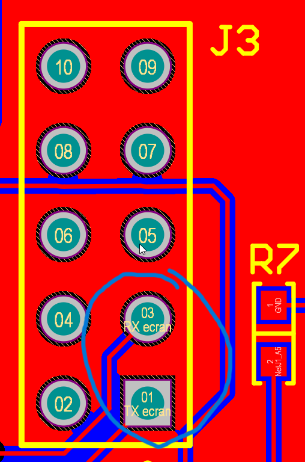
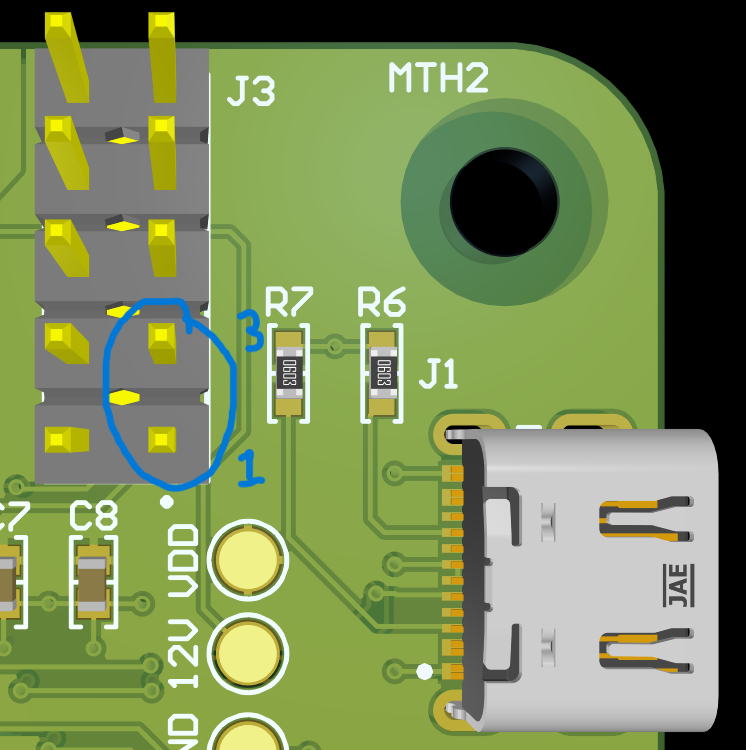
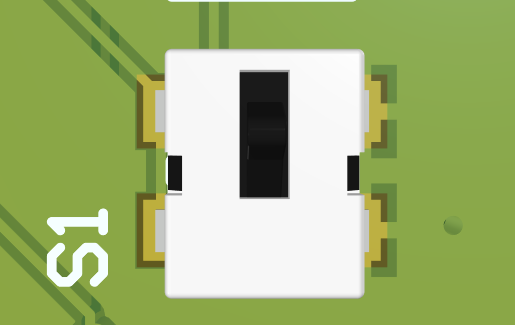
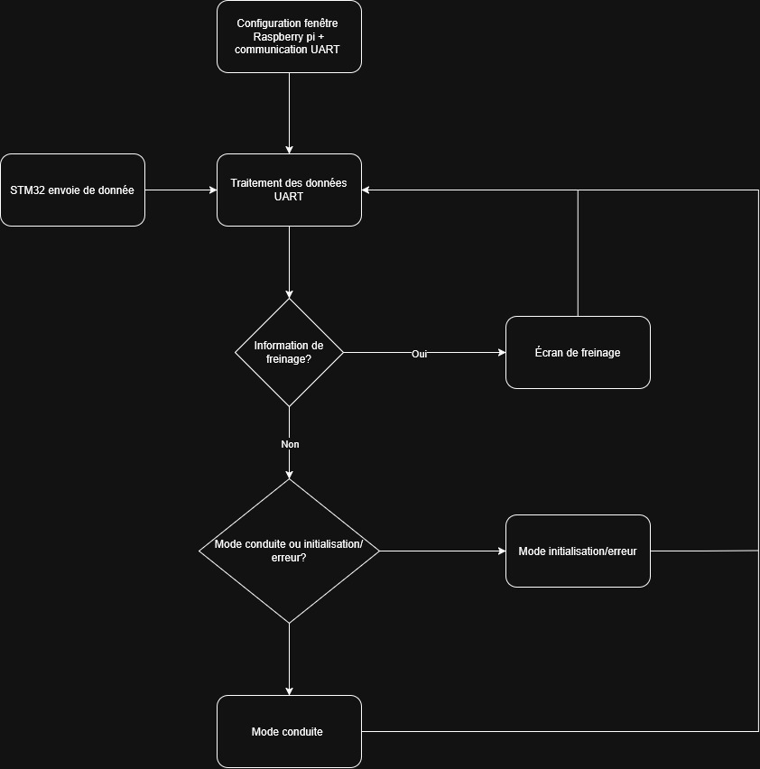

## Guide de développement
### Description
Ceci est le guide de développement. Il contient les branchements du module tableau de bord ainsi qu'une explication complète de son affichage, de son branchement, du déboggage ainsi qu'un résumé du code.

Pour retourner au README, cliquer [ici](<../README.md>)

### Branchement

**1.** Alimenter le PCB avec l'alimentation 12V.
 
**2.** Brancher le câble HDMI dans le port HDMI du Raspberry Pi.
 
**3.** Alimenter le Raspberry Pi avec un câble USB-C.
 
**4.** Brancher le BMI avec un câble I2C | Exemple : [4399](https://www.digikey.ca/en/products/detail/adafruit-industries-llc/4399/10824268?gclsrc=aw.ds&gad_source=1&gad_campaignid=17336435733&gclid=Cj0KCQjwqPLOBhCiARIsAKRMPZrVaYoQh6BjAgbfN6MktjoXuiRVQwjho6AzrgFkBbMqADUwDK0_j78aAlHEEALw_wcB)

**5.** Brancher un câble style Arduino [1956](https://www.digikey.ca/en/products/detail/adafruit-industries-llc/1956/6827089?gclsrc=aw.ds&gad_source=1&gad_campaignid=17336435733&gclid=Cj0KCQjwqPLOBhCiARIsAKRMPZrF_uWWoAdkNR1Ewwv0g-x9TCiTK35vVDDhfwSZ4tV42QfpkmZLDrMaAquCEALw_wcB) entre la patte 1 du header (Tx) *J3* sur la carte STM32 et la patte 8 du Raspberry Pi. Refaire ces mêmes opérations entre la patte 3 du header (Rx) *J3* sur la carte STM32 et la patte 10 du Raspberry Pi.

Cela établit la communication UART entre la carte STM32 et le Raspberry Pi.

Images des pattes de la carte STM32 et du Raspberry Pi :





### Branchement optionnel
**Programmation et déboggage :**

**1.** Brancher un câble USB-C dans le connecteur USB-C pour accéder au déboggage (port série) et à la programmation.
- Nécessite d'activer la bootstrap (*Switch 1*) pour entrer en mode programmation.



**2.** Brancher le câble [STLINK-V3MINIE](https://www.digikey.ca/en/products/detail/stmicroelectronics/STLINK-V3MINIE/16284301?gclsrc=aw.ds&gad_source=1&gad_campaignid=20291760415&gclid=Cj0KCQjwqPLOBhCiARIsAKRMPZrdradtKU4q_vTU92Uq2YcJ_Uhwx3DESK_N5jiYhfYq7sia4Z_wBz0aAmmFEALw_wcB) pour accéder au déboggage (CubeIDE) et à la programmation (CubeIDE).

### Déboggage

#### DELs
**1.** D1 s'allume quand l'alimentation VDD (3V3) est présente (alimentation debug).

**2.** D2 s'allume quand l'alimentation 12V est présente (alimentation debug).

**3.** D3 s'allume quand un signal vers GPIO18 (du tableau de bord vers la carte de contrôle) est envoyé.

**4.** D4 s'allume quand un signal vers GPIO21 (du tableau de bord vers la carte de contrôle) est envoyé.

**5.** D5 s'allume quand un signal vers GPIO0 (du tableau de bord vers la carte de contrôle) est envoyé.

**6.** D6 et D7 sont des DELs de déboggage programmables (à partir du code STM32).

#### Switches
**1.** La switch *S2* (NRST | RESET) permet de réinitialiser le tableau de bord.

**2.** La switch *S3* (RESET | CTRL) permet de réinitialiser la carte de contrôle.

**3.** La switch *S1* (BOOT0) est une bootstrap permettant de configurer le mode de démarrage (mode programmation et mode *Firmware* | mode normal).

#### Points de test
**1.** Un point de test est disponible pour mesurer la tension de l'alimentation 12V.

**2.** Un autre point de test est disponible pour accéder au ground.

**3.** Il est possible d'analyser l'échange de données entre la carte du tableau de bord et le Raspberry Pi en utilisant la patte 1 du header (Tx) *J3* et la patte 3 du header (Rx) *J3*. Cependant, l'analyse des données ne peut pas se faire en même temps que la connexion avec le Raspberry Pi (à moins d'utiliser un splitter ou une autre méthode semblable).

### Résumé du code

Le code commence par tenter d'accéder au port UART. Ensuite, il traite les données (sous format JSON) et effectue la logique vue dans l'ordinogramme. Il affiche ensuite les informations sous forme d'interface utilisateur.

#### Ordinogramme



#### tk_main_exp.py
*L'ensemble des fonctions du code Raspberry Pi est contenu dans la classe :*

```python
class speedometer(ttk.Frame):
```

*Les fonctions contenues dans cette classe sont les suivantes :*

```python
__init__(self, master, max_speed=51, size=1000)
```

Cette fonction gère l'initialisation des divers éléments présents dans l'interface utilisateur (cadres, texte, icônes, etc.) ainsi que les paramètres de configuration de la fenêtre.

- `max_speed` : vitesse maximale de la trottinette. Cela ajuste le ratio vitesse par rapport à la complétion du cercle.
- `size` : grosseur de la fenêtre (même grandeur pour X et Y).

```python
set_power(self, power_percent)
```

Cette fonction gère la configuration graphique de l'arrière-plan selon la puissance fournie au moteur (le pourcentage fourni et non l'ampérage fourni).

```python
set_speed(self, speed)
```

Cette fonction gère les calculs nécessaires pour l'affichage de l'indicateur de vitesse.

```python
show_data_drive(self, temps, battery, motor_current, motor_mode, power_percent, lights, state)
show_data_other(self, error_code, key_state, e_stop, state, fwver, hwver)
```

Ces fonctions gèrent la sélection des éléments à afficher à l'utilisateur dépendamment du mode.

```python
show_break_screen(self)
```

Cette fonction gère l'affichage de l'écran de freinage.

```python
read_UART(self)
```

Cette fonction lit et traite les informations transmises par le tableau de bord. Cette fonction dicte le mode d'affichage (normal, initialisation/erreur et freinage).

```python
try:
    uart_conf = serial.Serial("/dev/serial0", 9600, timeout=1)
except:
    print("Port not found, using dummy data instead.")
```

Cette section du code tente d'accéder au port UART. Si le port n'est pas disponible, des données fictives (*dummy data*) sont utilisées à la place.

#### Code STM32 `main.c`

```c
if(HAL_UART_Receive(&huart1, &byte, 1, 0) == HAL_OK) // agit comme pass-through bridge
{
    HAL_UART_Transmit(&huart2, &byte, 1, HAL_MAX_DELAY);
}
```

Cette fonction agit comme un *pass-through bridge* (renvoie directement les informations reçues par la carte de contrôle vers le Raspberry Pi).

### Codes d'erreurs

En mode erreur (*ERROR*), une variété de codes d'erreurs différents peuvent s'afficher à l'écran. Ci-dessous se présente une liste des erreurs possibles avec une courte description.

## Fault Status

**FAULT:** au moins une erreur active.

### General Driver Faults
- **VDS_OCP:** DRV - VDS monitor overcurrent
- **GDF:** DRV - gate drive fault
- **UVLO:** DRV - undervoltage lockout
- **OTSD:** DRV - overtemperature shutdown
- **OTW:** DRV - overtemperature warning
- **CPUV:** DRV - charge pump undervoltage fault condition

### Phase A Faults
- **VDS_HA:** DRV - VDS overcurrent fault on the A high-side
- **VDS_LA:** DRV - VDS overcurrent fault on the A low-side
- **SA_OC:** DRV - overcurrent on phase A sense amplifier
- **VGS_HA:** DRV - gate drive fault on the A high-side MOSFET
- **VGS_LA:** DRV - gate drive fault on the A low-side MOSFET

### Phase B Faults
- **VDS_HB:** DRV - VDS overcurrent fault on the B high-side
- **VDS_LB:** DRV - VDS overcurrent fault on the B low-side
- **SB_OC:** DRV - overcurrent on phase B sense amplifier
- **VGS_HB:** DRV - gate drive fault on the B high-side MOSFET
- **VGS_LB:** DRV - gate drive fault on the B low-side MOSFET

### Phase C Faults
- **VDS_HC:** DRV - VDS overcurrent fault on the C high-side
- **VDS_LC:** DRV - VDS overcurrent fault on the C low-side
- **SC_OC:** DRV - overcurrent on phase C sense amplifier
- **VGS_HC:** DRV - gate drive fault on the C high-side MOSFET
- **VGS_LC:** DRV - gate drive fault on the C low-side MOSFET

## Guide de développement
### Descritption
Ceci est le guide de développement. Il contient les branchements du module tableau de bord et un explication complète de son affichage, branchement, déboggage ainsi qu'un résumé du code 
Pour retourner au README clicker [ici](<../README.md>)
### Branchement

**1.** Alimenter le PCB avec l'alimentation 12V
 
**2.** Brancher le cable HDMI dans le port HDMI du Raspberry Pi
 
**3.** Alimenter le Raspberry Pi avec un cable USB-C
 
**5.** Brancher le BMI avec un câble I2C | Exemple: [4399](https://www.digikey.ca/en/products/detail/adafruit-industries-llc/4399/10824268?gclsrc=aw.ds&gad_source=1&gad_campaignid=17336435733&gclid=Cj0KCQjwqPLOBhCiARIsAKRMPZrVaYoQh6BjAgbfN6MktjoXuiRVQwjho6AzrgFkBbMqADUwDK0_j78aAlHEEALw_wcB)

**6.** Brancher un cable style arduino [1956](https://www.digikey.ca/en/products/detail/adafruit-industries-llc/1956/6827089?gclsrc=aw.ds&gad_source=1&gad_campaignid=17336435733&gclid=Cj0KCQjwqPLOBhCiARIsAKRMPZrF_uWWoAdkNR1Ewwv0g-x9TCiTK35vVDDhfwSZ4tV42QfpkmZLDrMaAquCEALw_wcB) entre la patte 1 du header (Tx) *J3* sur la carte STM32 et la patte 8 du Raspberry Pi. Refaire ces mêmes opérations entre la patte 3 du header (Rx) *J3* sur la carte STM32 et la patte 10 du Raspberry Pi. Cela établi la communication UART entre la carte STM32 et le Raspberry Pi. Images des pattes de la carte STM32 et du Raspberry Pi. 

.

### Branchement Optionnel
**Programmation et déboggage:** 

**1.** Brancher un cable USB-C dans le connecteur USB-C pour accèder au déboggage (port série) et programmation.
  - Nécessite d'activer la bootstrap (Switch 1) pour entrer en mode Programmation 

**2.** Brancher le cable [STLINK-V3MINIE](https://www.digikey.ca/en/products/detail/stmicroelectronics/STLINK-V3MINIE/16284301?gclsrc=aw.ds&gad_source=1&gad_campaignid=20291760415&gclid=Cj0KCQjwqPLOBhCiARIsAKRMPZrdradtKU4q_vTU92Uq2YcJ_Uhwx3DESK_N5jiYhfYq7sia4Z_wBz0aAmmFEALw_wcB) pour accèder au déboggage (CubeIDE) et programmation (CubeIDE)

### Déboggage

#### DELs
**1.** D1 s'allume quand l'alimentation VDD (3V3) est présente (Alim Debug)

**2.** D2 s'allume quand l'alimentation 12V est présente (Alim Debug)

**3.** D3 s'allume quand un signal vers GPIO18 (du tableau de bord vers la carte contrôle) est envoyé 

**4.** D4 s'allume quand un signal vers GPIO21 (du tableau de bord vers la carte contrôle) est envoyé 

**5.** D4 s'allume quand un signal vers GPIO0 (du tableau de bord vers la carte contrôle) est envoyé 

**6.** D5 et D6 sont des DELs de déboggages programmables (à partir du code STM32).
#### Switches
**1.** La switch *S2* (NRST | RESET) permet de réinitialiser le tableau de bord.

**2.** La switch *S3* (RESET | CTRL) permet de réinitialiser la carte de contrôle.

**3.** La switch *S1* (Boot0) est une bootstrap permettant de configurer le boot mode (Mode programmation et Mode "Firmware" | Mode normale)
#### Points de tests
**1.** Un point de test est disponible pour mesurer la tension de l'alimentation 12V.

**2.** Un autre point de test est disponible pour accèder au ground.

**3.** Il est possible d'analyser l'échange de données entre la carte du tableau de bord et le raspberry pi en utilisant la patte 1 du header (Tx) *J3* et la patte 3 du header (Tx) *J3*. Cependant, l'analyse de donnée ne peut pas se faire en même temps que la connection avec le raspberry pi (à moins d'utiliser un splitter ou autre méthode semblable).

### Résumé du code

Le code commence par tenter d'accèder au port UART. Ensuite, il traite les données (sous format JSON) et éffectue la logique vue dans l'ordinogramme. Il affiche ensuite les informations sous forme d'un interface utilisateur.

#### Ordinogramme


#### tk_main_exp.py
*L'ensemble des fonctions du code raspberry pi est contenue dans la classe:*
```python
class speedometer(ttk.Frame):
```
*Les fonctions contenue dans cette classe sont les suivantes:* 

```python
__init__(self, master, max_speed=51, size=1000)
```
Cette fonction gère l'initialisation des divers éléments présents dans l'interface de l'utilisateur (cadre, texte, icon etc...) ainsi que des paramètres de configurations de la fenêtre.
- max_speed: Vitesse maximale de la trottinette. Cela scale le ratio vitesse par rapport à la complétion du cercle.
- size: Grosseur de la fenêtre (même grandeur pour x et y) 
```python
set_power(self, power_percent)
```
Cette fonction gère la configuration graphique de l'arrière plan selon la puissance fournis au moteur (le pourcentage fournis et non l'ampérage fournis)
```python
set_speed(self, speed)
```
Cette fonction gère le calcul nécessaire pour l'affichage de l'indicateur de vitesse.
```python
show_data_drive(self, temps, battery, motor_current, motor_mode, power_percent, lights, state)
show_data_other(self, error_code, key_state, e_stop, state, fwver, hwver)
```
Ces fonctions gèrent la sélection des éléments à afficher à l'utilisateur dépendemment du mode.
```python
show_break_screen(self)
```
Cette fonction gère l'affichage de  l'écran de freinage.
```python
read_UART(self)
```
Cette fonction lit et traite les information transmise par le tableau de bord. Cette fonction dicte qu'elle mode d'affichage (Normal, Initialisation/Erreur et freinage)
```python
try:
    uart_conf = serial.Serial("/dev/serial0", 9600, timeout=1)
except:
    print("Port not found, using dummy data instead.")
```
Cette section du code gère la configuration graphique de l'arrière plan selon la puissance fournis au moteur (le pourcentage fournis et non l'ampérage fournis)

#### code STM32 main.c

```python
if(HAL_UART_Receive(&huart1, &byte, 1, 0) == HAL_OK) //agis comme pass through bridge

    if(HAL_UART_Receive(&huart1, &byte, 1, 0) == HAL_OK)
    {
        HAL_UART_Transmit(&huart2, &byte, 1, HAL_MAX_DELAY);
    }
```
Cette fonction agis comme pass through bridge (renvoie directement les informations reçue par la carte de contrôle vers le raspberry pi)

### Codes d'erreurs

En mode erreur (ERROR), une variétée de codes d'erreurs différents peuvent s'afficher à l'écran. Ci dessous se présente une liste des erreurs possibles avec une courte déscription.

## Fault Status

**FAULT:** at least 1 fault active  

### General Driver Faults
- **VDS_OCP:** DRV - VDS monitor overcurrent  
- **GDF:** DRV - gate drive fault  
- **UVLO:** DRV - undervoltage lockout  
- **OTSD:** DRV - overtemperature shutdown  
- **OTW:** DRV - overtemperature warning  
- **CPUV:** DRV - charge pump undervoltage fault condition  

### Phase A Faults
- **VDS_HA:** DRV - VDS overcurrent fault on the A high-side  
- **VDS_LA:** DRV - VDS overcurrent fault on the A low-side  
- **SA_OC:** DRV - overcurrent on phase A sense amplifier  
- **VGS_HA:** DRV - gate drive fault on the A high-side MOSFET  
- **VGS_LA:** DRV - gate drive fault on the A low-side MOSFET  

### Phase B Faults
- **VDS_HB:** DRV - VDS overcurrent fault on the B high-side  
- **VDS_LB:** DRV - VDS overcurrent fault on the B low-side  
- **SB_OC:** DRV - overcurrent on phase B sense amplifier  
- **VGS_HB:** DRV - gate drive fault on the B high-side MOSFET  
- **VGS_LB:** DRV - gate drive fault on the B low-side MOSFET  

### Phase C Faults
- **VDS_HC:** DRV - VDS overcurrent fault on the C high-side  
- **VDS_LC:** DRV - VDS overcurrent fault on the C low-side  
- **SC_OC:** DRV - overcurrent on phase C sense amplifier  
- **VGS_HC:** DRV - gate drive fault on the C high-side MOSFET  
- **VGS_LC:** DRV - gate drive fault on the C low-side MOSFET  
