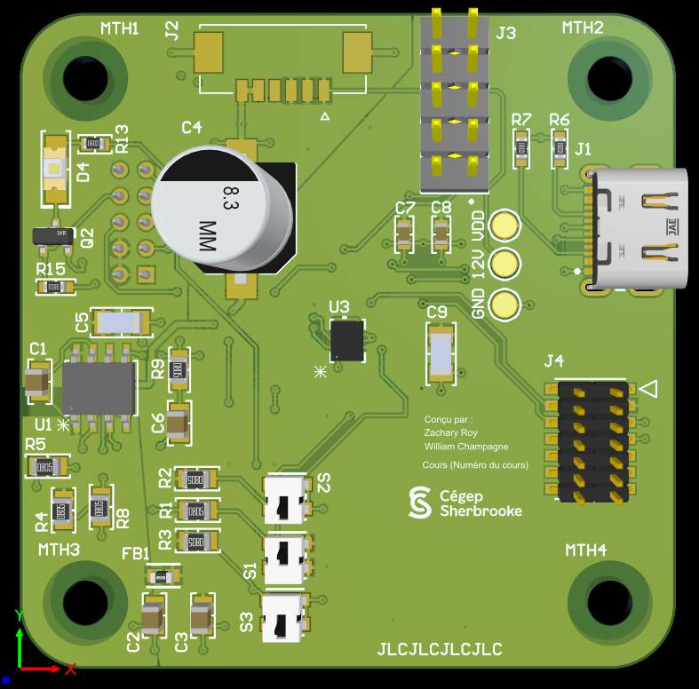
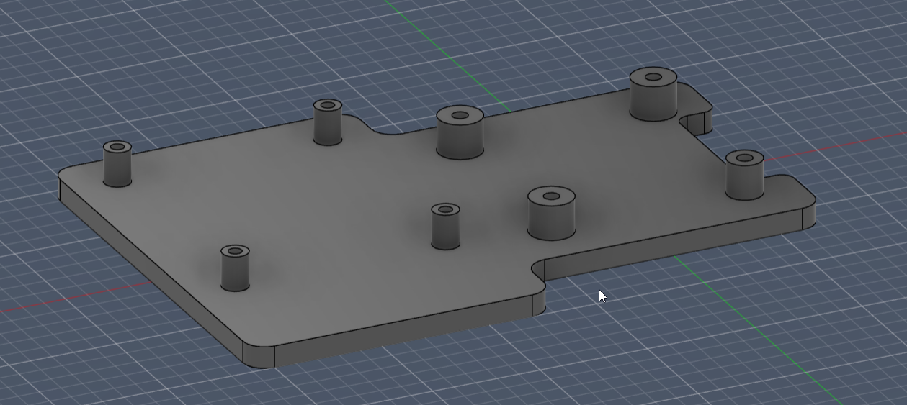

# ProjetTrottinette

Projet éffectué par: Zachary Roy et William Champagne

Ce projet entreprant la conception d'un écran de tableau de bord pour une trottinette électrique. Ce tableau de bord est capable d'afficher les informations concernant la trottinette de façons éfficace, précise et éfficace sur un écran.

## Prérequis
Une trottinette fonctionelle (*nom du modèle de la trottinette ici*) auquelle le module de tableau de bord est branché.

### Matériel
**1.** Boitier

**2.** PCB    

**3.** Écran (raspberry PI)

### Logiciel
**1.** STM32CubeIDE, CubeMX et VsCode
    - Tkinter et Pillow doivent être installé  
    
    pip install Pillow
    pip install tk 

**1.** Altium -> PCB 
    - Librairie Celestial utilisée
    - Librairie étudiante utilisée

**3.** Fusion 360 -> Modèle 3D 

### Limitations
L'affichage est limité à une vitesse de rafraîchissement de 5 Hz
La version actuelle est limitée a une utilisation stationnaire dû à l'écran hdmi nécéssitant une station fixe.

## Structure

### 3DModels
Cette section recueille les modèles 3D nécessaires pour la fabrication et manufacturation du PCB et du support à ce même PCB.

**1.** Modèle 3D de la [carte du tableau de bord.](<3DModels/>)

**2.** Modèle 3D du [support](<3DModels/>) pour la carte du tableau de bord et le raspberry pi. 

### Autres

Cette section contient le journal de bord, la distribution des tâches au travers de la journée, les difficultées rencontrées ainsi que les solutions trouvées à ces mêmes problèmes.

### Code
Cette section contient les fichiers code du [STM32](<Code/STM32/>) et du [Raspberry Pi](<Code/STM32/>)

- #### Raspberry Pi 3b
**tk_main.py** code gérant l'affichage de l'interface de l'utilisateur et la communication UART. 

**icons** fichier contenant les icones nécessaire pour l'affichage de l'interface utilisateur.

- #### STM32

**stm32_main.c** code "pass through" de l'information uart, faisant le pont entre la carte de contrôle et le raspberry pi.

### Datasheets
Cette section contient les diverses [datasheets](<Datasheets/>) utilisées pour la conception du schéma électrique. 

### Schéma
La section "Schematics" du dépôt github contient les shémas suivant : 

**1.** Shéma bloc *Vielle version* 

**2.** Shéma électrique 

**3.** Ordinogrammes | Pour le code du raspberry pi (*Ordinogramme 1*) et le code du STM32 (*Ordinogramme 2*)

## Utilisation
**1.** Brancher et allumer les composantes

**2.** Lancer le logiciel *tk_main.exe* (À faire un executable du code python)

**3.** Utiliser la trottinette

### Code STM32 et Python
La section "Code" du dépôt github contient les codes suivant : 
- stm32_main.c -> Code main du microcontrolleur STM32.
- tk_main.py -> Code python pour l'écran.

### Pour un utilisateur
Voir [Guide d'utilisateur](<Guides/guide_user.md>)

### Pour un developpeur
Voir [Guide de développement](<Guides/guide_dev.md>)

### Prochaines étapes (todo)
